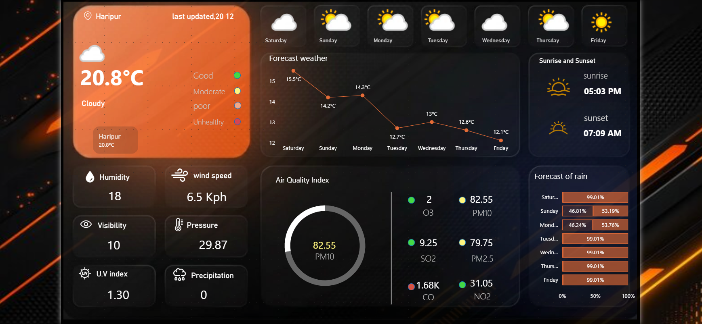

# 🌦️ Weather Dashboard (Power BI)

A modern and interactive **Weather Dashboard** built using **Power BI** and a **Weather API**.  
This dashboard provides real-time weather insights, forecasts, and air quality analysis in a visually appealing format.

---

## 📊 Overview

This project focuses on visualizing weather data in a professional dashboard using Power BI.  
It helps users quickly understand current weather conditions and future trends.

---

## 🚀 Features

- 🌡️ Current temperature and weather condition
- 📅 7-day weather forecast
- 🌫️ Air Quality Index (AQI)
- 💨 Wind speed and humidity
- 👁️ Visibility and pressure
- ☀️ UV Index
- 🌅 Sunrise & Sunset timings
- 🌧️ Rain probability forecast

---

## 🛠️ Tools & Technologies

- **Power BI**
- **Weather API** (for real-time data)
- Data Visualization techniques

---

## 📸 Dashboard Preview

---

## 📂 Project File

- `Weather Dashboard.pbix` → Power BI dashboard file
- `dashboard.png` → Dashboard preview image

---

## ⚙️ How to Use

1. Download the `.pbix` file  
2. Open it in **Power BI Desktop**  
3. Refresh the data (if API is connected)  
4. Explore the dashboard  

---

## 🌟 Key Highlights

- Clean and modern UI design  
- Interactive visuals  
- Real-time data integration  
- Easy to understand insights  

---

## 📄 License

This project is for educational purposes.

---
